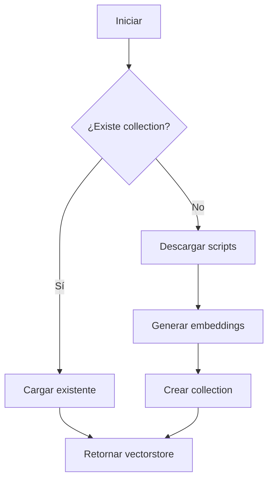

# Arquitectura y Documentación Técnica — Star Wars Expert

**Versión:** 1.0  
**Última actualización:** 2026-01-27  
**Stack:** Python 3.10+ | LangChain 1.2+ | Qdrant 1.16+ | OpenAI API

---

## 1. Arquitectura General

### 1.1 Visión de Alto Nivel

```
┌─────────────────────────────────────────────────────────────────────────┐
│                           STAR WARS EXPERT                              │
├─────────────────────────────────────────────────────────────────────────┤
│                                                                         │
│  ┌──────────────┐    ┌───────────────┐    ┌──────────────────────────┐  │
│  │   IMSDB.com  │───▶│  loader.py    |───▶│    vectorstore.py        │  │
│  │  (Scripts)   │    │  (Fetch+Parse)│    │    (Qdrant Local)        │  │
│  └──────────────┘    └───────────────┘    └────────────┬─────────────┘  │
│                                                        │                │
│                                                        ▼                │
│  ┌──────────────┐    ┌──────────────┐    ┌──────────────────────────┐   │
│  │   Terminal   │◀──▶│   chat.py    │◀───│      OpenAI API          │   │
│  │    (User)    │    │  (RAG Chain) │    │  (GPT-4o + Embeddings)   │   │
│  └──────────────┘    └──────────────┘    └──────────────────────────┘   │
│                             │                                           │
│                    ┌────────┴────────┐                                  │
│                    │    config.py    │                                  │
│                    │  (All Settings) │                                  │
│                    └─────────────────┘                                  │
│                                                                         │
└─────────────────────────────────────────────────────────────────────────┘
```

### 1.2 Estructura del Repositorio

```
star-wars-expert/
├── main.py              # Entry point, orquestación principal
├── config.py            # Configuración centralizada
├── loader.py            # Descarga y procesamiento de scripts
├── vectorstore.py       # Gestión de Qdrant vector store
├── chat.py              # RAG chain y loop de conversación
├── ui.py                # Componentes visuales (progress, spinners)
├── tests/               # Tests unitarios e integración
│   ├── __init__.py
│   ├── test_config.py
│   ├── test_loader.py
│   └── test_rag_integration.py
├── qdrant_db/           # Vector store persistido (generado)
├── .env                 # Variables de entorno (no versionado)
├── .env.example         # Template de variables
├── pyproject.toml       # Configuración de proyecto y dependencias
├── uv.lock              # Lockfile de dependencias
└── README.md            # Documentación de usuario
```

---

## 2. Componentes del Sistema

### 2.1 Entry Point: [main.py](file:///Users/salo/dev/langchain/star-wars-expert/main.py)

**Responsabilidad:** Orquestación del ciclo de vida de la aplicación.

```python
# Flujo principal
def main():
    console = Console()
    vectorstore = get_or_create_vectorstore(console)  # Inicialización
    rag_chain, memory = create_rag_chain(vectorstore) # Pipeline RAG
    run_chat_loop(rag_chain, memory)                  # Loop interactivo
```

| Función | Descripción |
|---------|-------------|
| `validate_environment()` | Verifica `OPENAI_API_KEY` antes de iniciar |
| `main()` | Orquesta init → chat → cleanup |

**Manejo de errores:**

- `KeyboardInterrupt` → Exit graceful con mensaje
- `Exception` genérica → Error message + exit code 1

---

### 2.2 Configuración: [config.py](file:///Users/salo/dev/langchain/star-wars-expert/config.py)

**Responsabilidad:** Centralizar todas las constantes configurables.

#### Categorías de Configuración

| Categoría | Constantes |
|-----------|------------|
| Vector Store | `PERSIST_PATH`, `COLLECTION_NAME` |
| LLM | `LLM_MODEL`, `LLM_TEMPERATURE`, `EMBEDDING_MODEL` |
| Retriever | `RETRIEVER_K` |
| Memory | `MEMORY_K` |
| Text Splitting | `CHUNK_SIZE`, `CHUNK_OVERLAP` |
| HTTP | `REQUEST_TIMEOUT`, `MAX_RETRIES`, `RETRY_BACKOFF_FACTOR` |
| UI | `TYPING_DELAY`, `SPINNER_FRAMES` |
| Data | `STAR_WARS_SCRIPTS` (lista de URLs) |
| Prompts | `PROMPT_TEMPLATE` |

#### Valores por Defecto

```python
# Vector Store
PERSIST_PATH = "./qdrant_db"
COLLECTION_NAME = "star_wars_scripts"

# LLM
LLM_MODEL = "gpt-4o"
LLM_TEMPERATURE = 0
EMBEDDING_MODEL = "text-embedding-3-small"

# Retriever & Memory
RETRIEVER_K = 15
MEMORY_K = 5

# Text Splitting
CHUNK_SIZE = 2500
CHUNK_OVERLAP = 250

# HTTP
REQUEST_TIMEOUT = 30
MAX_RETRIES = 3
RETRY_BACKOFF_FACTOR = 2
```

---

### 2.3 Cargador de Scripts: [loader.py](file:///Users/salo/dev/langchain/star-wars-expert/loader.py)

**Responsabilidad:** Descargar, parsear y chunkar scripts de IMSDB.

#### Funciones Principales

| Función | Entrada | Salida |
|---------|---------|--------|
| `load_star_wars_script()` | URL, título | `Document` |
| `load_and_split_scripts()` | Console | `list[Document]` |

#### Estrategia de Retry

```python
for attempt in range(1, MAX_RETRIES + 1):
    try:
        response = requests.get(url, timeout=REQUEST_TIMEOUT)
        response.raise_for_status()
        # ... procesar
    except Timeout/ConnectionError:
        wait_time = RETRY_BACKOFF_FACTOR ** attempt  # 2s, 4s, 8s
        time.sleep(wait_time)
    except HTTPError as e:
        if e.response.status_code < 500:  # 4xx no retry
            raise
```

#### Text Splitting

```python
RecursiveCharacterTextSplitter(
    chunk_size=2500,
    chunk_overlap=250,
    separators=["\nINT.", "\nEXT.", "\n\n", "\n", " ", ""]
)
```

> [!IMPORTANT]
> Los separadores `\nINT.` y `\nEXT.` son específicos de formato de guión cinematográfico y preservan límites de escenas.

---

### 2.4 Vector Store: [vectorstore.py](file:///Users/salo/dev/langchain/star-wars-expert/vectorstore.py)

**Responsabilidad:** Gestionar persistencia y acceso al índice vectorial.

#### Función Principal

```python
def get_or_create_vectorstore(console: Console) -> QdrantVectorStore
```

#### Lógica de Decisión



#### Detalles de Implementación

| Aspecto | Implementación |
|---------|----------------|
| Cliente | `QdrantClient(path="./qdrant_db")` (file-based) |
| Embeddings | `OpenAIEmbeddings(model="text-embedding-3-small")` |
| Detección existente | `client.get_collection()` → `ValueError` si no existe |
| Creación | `QdrantVectorStore.from_documents()` |

---

### 2.5 RAG Chain: [chat.py](file:///Users/salo/dev/langchain/star-wars-expert/chat.py)

**Responsabilidad:** Pipeline de recuperación y generación + loop interactivo.

#### Clase: ConversationMemory

```python
class ConversationMemory:
    def __init__(self, k: int = 5):       # Turnos a recordar
    def add_user_message(content: str)     # Agregar mensaje usuario
    def add_ai_message(content: str)       # Agregar mensaje AI
    def get_history_string() -> str        # Formatear historial
    def clear()                            # Limpiar memoria
```

**Comportamiento:**

- Mantiene últimos `k * 2` mensajes (k turnos = k preguntas + k respuestas)
- Trunca mensajes > 500 caracteres para optimizar contexto
- Formato de salida: `User: ... \n Assistant: ...`

#### Pipeline LCEL

```python
rag_chain = (
    RunnableLambda(get_context_and_history)  # Retrieval + Memory
    | prompt                                   # ChatPromptTemplate
    | llm                                      # ChatOpenAI (streaming)
    | StrOutputParser()                        # Texto final
)
```

#### Diagrama del Pipeline

```
┌─────────────┐    ┌──────────────────┐    ┌───────────────┐
│   Query     │───▶│  get_context_    │───▶│   Prompt      │
│  (string)   │    │  and_history()   │    │  Template     │
└─────────────┘    └──────────────────┘    └───────┬───────┘
                          │                        │
                   ┌──────┴──────┐                 ▼
                   │             │          ┌───────────────┐
            ┌──────┴──────┐  ┌───┴───┐      │   ChatOpenAI  │
            │  Retriever  │  │Memory │      │  (streaming)  │
            │   (k=15)    │  │       │      └───────┬───────┘
            └─────────────┘  └───────┘              │
                                                    ▼
                                           ┌───────────────┐
                                           │ StrOutputParser│
                                           └───────────────┘
```

#### Loop de Chat

```python
def run_chat_loop(rag_chain, memory):
    while True:
        query = input("You: ")
        if query.lower() in ["exit", "quit"]:
            break
        if query.lower() == "clear":
            memory.clear()
            continue
        
        memory.add_user_message(query)
        full_response = ""
        for chunk in rag_chain.stream(query):
            full_response += chunk
        
        # Separar respuesta de sugerencias
        # Imprimir con efecto typing
        memory.add_ai_message(main_answer)
```

---

### 2.6 Componentes UI: [ui.py](file:///Users/salo/dev/langchain/star-wars-expert/ui.py)

**Responsabilidad:** Feedback visual durante operaciones largas.

#### Clase: StepProgress

```python
class StepProgress:
    def __init__(console, steps: list[str], title: str)
    def start()      # Iniciar display con Live
    def advance()    # Marcar paso actual como done, iniciar siguiente
    def complete(message: str)  # Finalizar todos los pasos
```

**Características:**

- Spinner animado en thread separado (10 FPS)
- Estados por paso: `pending` → `running` → `done`
- Íconos: ○ (pending), ⠋⠙⠹... (running), ✓ (done)

---

## 3. Modelo de Datos

### 3.1 Documento (LangChain)

```python
Document(
    page_content: str,        # Contenido del chunk
    metadata: {
        "title": str,         # Nombre de la película
        "start_index": int    # Posición en documento original
    }
)
```

### 3.2 Mensajes de Memoria

```python
HumanMessage(content: str)
AIMessage(content: str)
```

### 3.3 Vector Store Schema (Qdrant)

| Campo | Tipo | Descripción |
|-------|------|-------------|
| `id` | UUID | Identificador único del vector |
| `vector` | float[1536] | Embedding text-embedding-3-small |
| `payload.page_content` | string | Texto del chunk |
| `payload.metadata` | dict | Metadatos (title, start_index) |

---

## 4. Integraciones Externas

### 4.1 OpenAI API

| Servicio | Modelo | Uso |
|----------|--------|-----|
| Embeddings | `text-embedding-3-small` | Vectorización de chunks y queries |
| Chat Completions | `gpt-4o` | Generación de respuestas |

**Configuración:**

```python
# Embeddings
OpenAIEmbeddings(model="text-embedding-3-small")

# Chat
ChatOpenAI(model="gpt-4o", temperature=0, streaming=True)
```

### 4.2 IMSDB.com

| Script | URL |
|--------|-----|
| A New Hope | `https://www.imsdb.com/scripts/Star-Wars-A-New-Hope.html` |
| Empire Strikes Back | `https://www.imsdb.com/scripts/Star-Wars-The-Empire-Strikes-Back.html` |
| Return of the Jedi | `https://www.imsdb.com/scripts/Star-Wars-Return-of-the-Jedi.html` |

**Parsing:** BeautifulSoup extrae contenido de `<pre>` tags.

---

## 5. Variables de Entorno

### 5.1 Requeridas

| Variable | Descripción | Ejemplo |
|----------|-------------|---------|
| `OPENAI_API_KEY` | API key de OpenAI | `sk-proj-...` |

### 5.2 Archivo .env.example

```bash
# OpenAI API Configuration
OPENAI_API_KEY=your-api-key-here
```

### 5.3 Validación

```python
# main.py
def validate_environment() -> bool:
    required_vars = {
        "OPENAI_API_KEY": "Required for OpenAI API access..."
    }
    # Retorna False si falta alguna
```

---

## 6. Estrategias de Caching y Rendering

### 6.1 Persistencia de Vector Store

| Aspecto | Estrategia |
|---------|------------|
| Ubicación | `./qdrant_db/` |
| Formato | SQLite (Qdrant file-based) |
| Invalidación | Manual (borrar directorio) |
| Tamaño estimado | ~5-10MB por script |

### 6.2 Streaming de Respuestas

```python
for chunk in rag_chain.stream(query):
    full_response += chunk
# Luego se imprime con typing effect
```

---

## 7. Manejo de Errores

### 7.1 Categorizacion

| Tipo | Manejo | Retry |
|------|--------|-------|
| `Timeout` | Log + retry | Sí (3x) |
| `ConnectionError` | Log + retry | Sí (3x) |
| `HTTPError 4xx` | Raise inmediato | No |
| `HTTPError 5xx` | Log + retry | Sí (3x) |
| `ValueError` (no `<pre>`) | Raise inmediato | No |
| `RuntimeError` | Log + exit | No |
| `OpenAI 429 Quota` | Mensaje descriptivo + URL billing | No |
| `OpenAI 401 Invalid Key` | Mensaje descriptivo + URL api-keys | No |
| `OpenAI Rate Limit` | Mensaje descriptivo | No |
| `Context Length Exceeded` | Sugerir `clear` | No |

### 7.2 Mensajes de Error al Usuario

```python
# API Key faltante
❌ Missing required environment variables:
  • OPENAI_API_KEY: Required for OpenAI API access

# Error de red
❌ Error: Failed to load script: Star Wars: A New Hope
Check your internet connection and try again.
```

---

## 8. Prompt Engineering

### 8.1 Template Principal

```python
PROMPT_TEMPLATE = """You are an expert Star Wars Movie Script Analyst...

Guidelines:
1. **Determine Question Type:**
   - Social pleasantries: Respond naturally
   - Off-topic: Brief answer + redirect to Star Wars
   - Star Wars related: Use ONLY script excerpts

2. **For Star Wars Questions:**
   - ONLY use information from provided scripts
   - Quote specific dialogue when relevant
   - If NOT in scripts: "I don't have information..."

3. **Use conversation history for context:**
   - Reference previous Q&A when relevant
   - Resolve pronouns using conversation context

- After answer, suggest 3 related questions

Conversation History:
{chat_history}

Context from Scripts:
{context}

Question: 
{question}

Answer:"""
```

### 8.2 Placeholders

| Placeholder | Fuente | Descripción |
|-------------|--------|-------------|
| `{chat_history}` | `ConversationMemory.get_history_string()` | Últimos 5 turnos |
| `{context}` | `retriever.invoke(query)` | 15 chunks relevantes |
| `{question}` | Input del usuario | Pregunta actual |

---

## 9. Testing

### 9.1 Estructura de Tests

| Archivo | Tipo | Descripción |
|---------|------|-------------|
| [test_config.py](file:///Users/salo/dev/langchain/star-wars-expert/tests/test_config.py) | Unit | Validación de constantes |
| [test_loader.py](file:///Users/salo/dev/langchain/star-wars-expert/tests/test_loader.py) | Unit | HTTP + parsing con mocks |
| [test_rag_integration.py](file:///Users/salo/dev/langchain/star-wars-expert/tests/test_rag_integration.py) | E2E | RAG completo con API |

### 9.2 Ejecución

```bash
# Unit tests (sin API)
uv run pytest tests/ -m "not integration"

# Integration tests (requiere API key)
uv run pytest tests/ -m integration

# Todos los tests
uv run pytest tests/ -v
```

### 9.3 Marker de Integración

```toml
# pyproject.toml
[tool.pytest.ini_options]
markers = [
    "integration: marks tests as integration tests"
]
```

---

## 10. Dependencias

### 10.1 Runtime

| Paquete | Versión | Propósito |
|---------|---------|-----------|
| `langchain` | ≥1.2.6 | Framework RAG |
| `langchain-openai` | ≥1.1.7 | Integración OpenAI |
| `langchain-qdrant` | ≥1.1.0 | Integración Qdrant |
| `langchain-text-splitters` | ≥1.1.0 | Chunking de texto |
| `qdrant-client` | ≥1.16.2 | Cliente vector store |
| `beautifulsoup4` | ≥4.14.3 | Parsing HTML |
| `python-dotenv` | ≥1.0.0 | Variables de entorno |
| `rich` | ≥13.7.0 | Terminal UI avanzado |
| `colorama` | ≥0.4.6 | Colores cross-platform |

### 10.2 Development

| Paquete | Versión | Propósito |
|---------|---------|-----------|
| `pytest` | ≥9.0.2 | Testing framework |
| `pytest-mock` | ≥3.15.1 | Mocking utilities |

---

## 11. Despliegue

### 11.1 Requisitos

- Python 3.10+
- `uv` package manager
- Conexión a internet (para OpenAI API)
- API key de OpenAI

### 11.2 Instalación

```bash
git clone https://github.com/SaloRB/star-wars-expert.git
cd star-wars-expert
uv sync
cp .env.example .env
# Editar .env con API key
```

### 11.3 Ejecución

```bash
uv run main.py
```

> [!NOTE]
> No hay configuración de CI/CD, Docker ni cloud deployments.
> La aplicación está diseñada para uso local.

---

## 12. Limitaciones Conocidas

| Área | Limitación |
|------|------------|
| Rate Limits | Sin manejo de HTTP 429 de OpenAI |
| Token Limits | Sin validación de longitud de contexto |
| Escalabilidad | Single-user, no concurrente |
| Persistencia | Historial no persiste entre sesiones |
| Observabilidad | Sin logging estructurado ni métricas |

---

## Referencias

- [LangChain Documentation](https://python.langchain.com/)
- [Qdrant Documentation](https://qdrant.tech/documentation/)
- [OpenAI API Reference](https://platform.openai.com/docs/api-reference)
