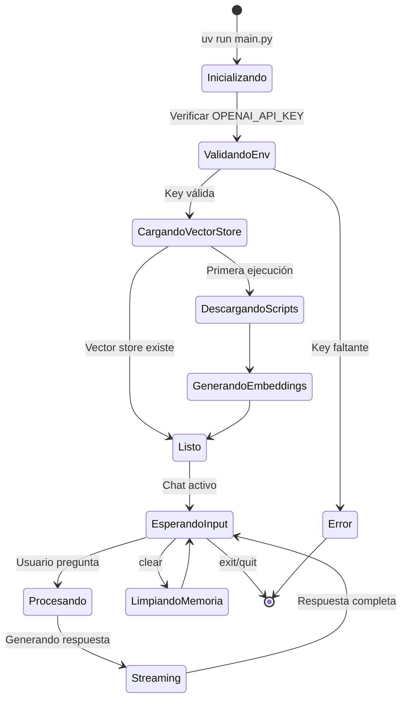

# Documentación Funcional — Star Wars Expert

**Versión:** 1.0  
**Última actualización:** 2026-01-27  
**Stack:** Python 3.10+ | LangChain | Qdrant | OpenAI GPT-4o

---

## 1. Resumen Ejecutivo

**Star Wars Expert** es un chatbot RAG (Retrieval-Augmented Generation) de línea de comandos que responde preguntas sobre la **trilogía original de Star Wars** (Episodios IV-VI) utilizando los scripts reales de las películas como fuente de verdad.

### Propuesta de Valor

| Característica | Descripción |
|----------------|-------------|
| **Precisión** | Respuestas basadas exclusivamente en scripts oficiales |
| **Memoria conversacional** | Recuerda contexto de últimas 5 interacciones |
| **Streaming** | Respuestas en tiempo real con efecto de escritura |
| **Sugerencias inteligentes** | Propone 3 preguntas relacionadas por respuesta |
| **Persistencia** | Vector store local evita re-procesar scripts |

---

## 2. Visión del Producto

### 2.1 Qué ES Star Wars Expert

- ✅ Asistente experto en los **scripts de la trilogía original** (A New Hope, Empire Strikes Back, Return of the Jedi)
- ✅ Herramienta de consulta para **diálogos, escenas y personajes** tal como aparecen en los guiones
- ✅ Aplicación **local y personal** sin dependencia de servidores externos (excepto OpenAI API)
- ✅ Software **open source** para aprendizaje de patrones RAG con LangChain

### 2.2 Qué NO ES Star Wars Expert

- ❌ **No** cubre precuelas, secuelas ni spin-offs
- ❌ **No** es una fuente de lore expandido (libros, cómics, series)
- ❌ **No** genera contenido creativo o fanfiction
- ❌ **No** es un servicio web ni tiene API REST
- ❌ **No** mantiene historial entre sesiones

---

## 3. Tipos de Usuario

### 3.1 Usuario Principal: Entusiasta/Desarrollador

| Atributo | Descripción |
|----------|-------------|
| **Perfil** | Fan de Star Wars con conocimientos técnicos básicos |
| **Motivación** | Explorar diálogos y escenas específicas de las películas |
| **Skills** | Capaz de usar terminal, configurar variables de entorno |
| **Dispositivo** | macOS/Linux/Windows con Python 3.10+ |

### 3.2 Usuario Secundario: Desarrollador LangChain

| Atributo | Descripción |
|----------|-------------|
| **Perfil** | Developer aprendiendo patrones RAG |
| **Motivación** | Estudiar implementación de referencia LangChain + Qdrant |
| **Skills** | Python intermedio, familiaridad con LLMs |

> [!NOTE]
> No existe sistema de roles ni permisos. Todos los usuarios tienen acceso completo a la funcionalidad.

---

## 4. Análisis Funcional

### 4.1 Módulos del Sistema

```
┌─────────────────────────────────────────────────────────────┐
│                        main.py                               │
│                    (Entry Point)                             │
├─────────────────────────────────────────────────────────────┤
│  ┌─────────────┐  ┌──────────────┐  ┌─────────────────────┐ │
│  │  loader.py  │  │vectorstore.py│  │      chat.py        │ │
│  │  (Scripts)  │──│  (Qdrant)    │──│  (RAG + Memory)     │ │
│  └─────────────┘  └──────────────┘  └─────────────────────┘ │
│         │                │                    │              │
│  ┌──────┴────────────────┴────────────────────┴───────────┐ │
│  │                     config.py                           │ │
│  │               (Configuración centralizada)              │ │
│  └─────────────────────────────────────────────────────────┘ │
│  ┌─────────────────────────────────────────────────────────┐ │
│  │                       ui.py                              │ │
│  │              (Componentes visuales)                      │ │
│  └─────────────────────────────────────────────────────────┘ │
└─────────────────────────────────────────────────────────────┘
```

### 4.2 Comandos Disponibles

| Comando | Acción | Contexto |
|---------|--------|----------|
| `exit` / `quit` | Terminar sesión | Durante chat |
| `clear` | Limpiar historial de conversación | Durante chat |
| *cualquier texto* | Enviar pregunta al asistente | Durante chat |

### 4.3 Estados del Sistema



---

## 5. Flujos Funcionales

### 5.1 Happy Path: Primera Ejecución

```
1. Usuario ejecuta `uv run main.py`
2. Sistema valida OPENAI_API_KEY en .env
3. Sistema descarga 3 scripts de IMSDB (~30-60s)
4. Sistema genera embeddings con OpenAI
5. Sistema guarda vector store en ./qdrant_db
6. Sistema muestra banner de bienvenida
7. Usuario escribe pregunta
8. Sistema recupera 15 chunks relevantes
9. Sistema genera respuesta streaming
10. Sistema muestra 3 preguntas sugeridas
11. Loop vuelve al paso 7
```

### 5.2 Happy Path: Ejecución Subsiguiente

```
1. Usuario ejecuta `uv run main.py`
2. Sistema valida OPENAI_API_KEY
3. Sistema detecta ./qdrant_db existente (~1s)
4. Sistema inicia chat inmediatamente
5. (continúa desde paso 7 del flujo anterior)
```

### 5.3 Flujo Alterno: Pregunta Fuera de Contexto

```
1. Usuario pregunta: "¿Cuál es la capital de Francia?"
2. Sistema responde brevemente (Paris)
3. Sistema redirige: "By the way, I specialize in Star Wars..."
4. Sistema sugiere preguntas de Star Wars
```

### 5.4 Flujo Alterno: Uso de Memoria Conversacional

```
1. Usuario: "¿Quién es Luke Skywalker?"
2. Sistema responde con contexto de scripts
3. Usuario: "¿Qué le pasa al final?"
4. Sistema resuelve "le" → Luke (de memoria)
5. Sistema responde sobre destino de Luke en ROTJ
```

### 5.5 Flujo de Error: API Key Faltante

```
1. Usuario ejecuta sin .env configurado
2. Sistema muestra error descriptivo:
   ❌ Missing required environment variables:
   • OPENAI_API_KEY: Required for OpenAI API access
3. Sistema sugiere: cp .env.example .env
4. Sistema termina con exit code 1
```

### 5.6 Flujo de Error: Red No Disponible

```
1. Sistema intenta descargar script
2. Timeout/ConnectionError detectado
3. Sistema reintenta (hasta 3 veces, backoff exponencial)
4. Si falla: RuntimeError con mensaje descriptivo
5. Sistema termina con exit code 1
```

---

## 6. User Stories

### 6.1 Módulo: Inicialización

| ID | User Story | Prioridad |
|----|------------|-----------|
| US-01 | Como usuario, quiero que el sistema valide mi API key al iniciar, para saber si mi configuración es correcta antes de usarlo | Alta |
| US-02 | Como usuario, quiero ver el progreso de descarga/indexación, para saber que el sistema está trabajando | Media |
| US-03 | Como usuario, quiero que los scripts se persistan localmente, para no repetir la descarga en cada ejecución | Alta |

### 6.2 Módulo: Chat

| ID | User Story | Prioridad |
|----|------------|-----------|
| US-04 | Como usuario, quiero hacer preguntas sobre Star Wars, para obtener información basada en los scripts reales | Alta |
| US-05 | Como usuario, quiero ver las respuestas con efecto de escritura, para una experiencia más natural | Baja |
| US-06 | Como usuario, quiero recibir sugerencias de preguntas relacionadas, para explorar más temas | Media |
| US-07 | Como usuario, quiero poder hacer preguntas de seguimiento (\"¿Qué le pasa después?\"), para mantener contexto | Alta |
| US-08 | Como usuario, quiero poder limpiar el historial con `clear`, para empezar conversación nueva | Media |
| US-09 | Como usuario, quiero salir con `exit` o `quit`, para terminar la sesión limpiamente | Alta |

### 6.3 Módulo: Manejo de Errores

| ID | User Story | Prioridad |
|----|------------|-----------|
| US-10 | Como usuario, quiero que el sistema reintente automáticamente si hay errores de red, para no perder mi sesión | Media |
| US-11 | Como usuario, quiero mensajes de error claros, para entender qué salió mal | Alta |

---

## 7. Criterios de Aceptación

### 7.1 Globales

| Criterio | Descripción |
|----------|-------------|
| **Tiempo de inicio (cold)** | < 90 segundos con red estable |
| **Tiempo de inicio (warm)** | < 3 segundos |
| **Tiempo de respuesta** | Inicio de streaming < 5 segundos |
| **Disponibilidad de API** | Requiere conexión a OpenAI API |

### 7.2 Por User Story

#### US-01: Validación de API Key

```gherkin
Scenario: API key presente
  Given el archivo .env contiene OPENAI_API_KEY válido
  When ejecuto uv run main.py
  Then el sistema inicia el proceso de carga
  And no muestra errores de configuración

Scenario: API key faltante
  Given el archivo .env no existe o está vacío
  When ejecuto uv run main.py
  Then veo mensaje "Missing required environment variables"
  And el sistema termina con exit code 1
```

#### US-04: Preguntas sobre Star Wars

```gherkin
Scenario: Pregunta sobre personaje conocido
  Given el sistema está en modo chat
  When pregunto "Who is Darth Vader?"
  Then recibo una respuesta que menciona "Vader"
  And la respuesta tiene más de 50 caracteres
  And se muestran 3 preguntas sugeridas

Scenario: Pregunta sobre personaje no existente
  Given el sistema está en modo chat
  When pregunto "Who is Jar Jar Binks?"
  Then recibo respuesta indicando falta de información
  And la respuesta menciona "original trilogy"
```

#### US-07: Memoria Conversacional

```gherkin
Scenario: Resolución de pronombres
  Given pregunté previamente sobre Luke Skywalker
  When pregunto "What happens to him at the end?"
  Then la respuesta se refiere a Luke
  And menciona eventos de Return of the Jedi
```

---

## 8. Reglas de Negocio

### 8.1 Fuentes de Datos

| Regla | Descripción |
|-------|-------------|
| RN-01 | Solo se procesan scripts de Episodios IV, V y VI |
| RN-02 | Los scripts se obtienen de IMSDB exclusivamente |
| RN-03 | El contenido se extrae del tag `<pre>` del HTML |

### 8.2 Procesamiento de Texto

| Regla | Descripción |
|-------|-------------|
| RN-04 | Chunks de 2500 caracteres con 250 de overlap |
| RN-05 | Separadores específicos de guión: `\nINT.`, `\nEXT.` |
| RN-06 | Se recuperan 15 chunks por pregunta |

### 8.3 Comportamiento del LLM

| Regla | Descripción |
|-------|-------------|
| RN-07 | Respuestas basadas exclusivamente en contexto recuperado |
| RN-08 | Preguntas off-topic reciben respuesta breve + redirección |
| RN-09 | Saludos se responden naturalmente sin redirección |
| RN-10 | Cada respuesta incluye 3 preguntas sugeridas |

### 8.4 Memoria

| Regla | Descripción |
|-------|-------------|
| RN-11 | Se mantienen últimos 5 intercambios (10 mensajes) |
| RN-12 | Mensajes largos se truncan a 500 caracteres en memoria |
| RN-13 | Comando `clear` borra toda la memoria |

---

## 9. Alcance / No Alcance

### 9.1 En Alcance (v1.0)

- ✅ Chat interactivo por terminal
- ✅ Preguntas sobre trilogía original
- ✅ Memoria conversacional dentro de sesión
- ✅ Persistencia de vector store
- ✅ Retry automático para errores de red
- ✅ Streaming de respuestas
- ✅ Sugerencias de preguntas relacionadas

### 9.2 Fuera de Alcance

- ❌ Interfaz web o GUI
- ❌ API REST
- ❌ Contenido de precuelas/secuelas
- ❌ Persistencia de historial de chat
- ❌ Multi-usuario
- ❌ Autenticación
- ❌ Métricas/Analytics
- ❌ Internacionalización (solo inglés)

---

## 10. Matriz de Permisos (RBAC)

> [!NOTE]
> No aplica. La aplicación no implementa sistema de roles ni permisos.
> Todos los usuarios tienen acceso completo a todas las funcionalidades.

---

## 11. Glosario de Términos

| Término | Definición |
|---------|------------|
| **RAG** | Retrieval-Augmented Generation. Patrón que combina búsqueda semántica con generación de texto |
| **Chunk** | Fragmento de texto resultante de dividir un documento largo |
| **Embedding** | Representación vectorial de texto que captura significado semántico |
| **Vector Store** | Base de datos optimizada para búsqueda por similitud de vectores |
| **IMSDB** | Internet Movie Script Database. Fuente de los guiones |
| **LangChain** | Framework Python para aplicaciones con LLMs |
| **Qdrant** | Motor de búsqueda vectorial usado como vector store |
| **LCEL** | LangChain Expression Language. Sintaxis para componer pipelines |
| **Streaming** | Entrega progresiva de respuesta conforme se genera |
| **Trilogía Original** | Episodes IV (A New Hope), V (Empire Strikes Back), VI (Return of the Jedi) |
| **Cold Start** | Primera ejecución que requiere descargar e indexar scripts |
| **Warm Start** | Ejecución posterior con vector store ya persistido |

---

## Referencias

- [README.md](file:///Users/salo/dev/langchain/star-wars-expert/README.md) — Documentación de instalación y uso
- [.github/copilot-instructions.md](file:///Users/salo/dev/langchain/star-wars-expert/.github/copilot-instructions.md) — Guía técnica para developers
- [config.py](file:///Users/salo/dev/langchain/star-wars-expert/config.py) — Configuración centralizada
